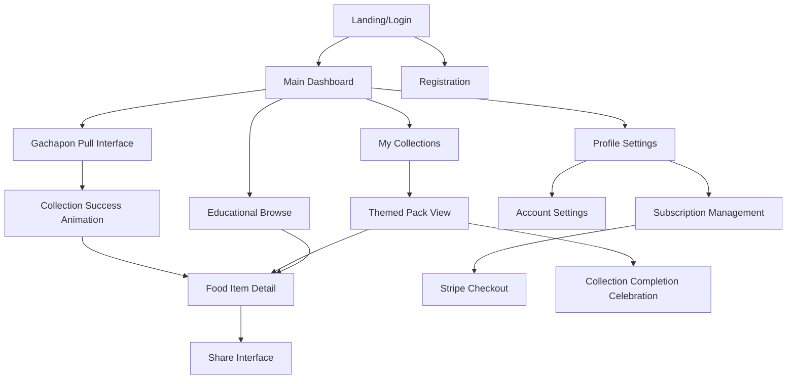
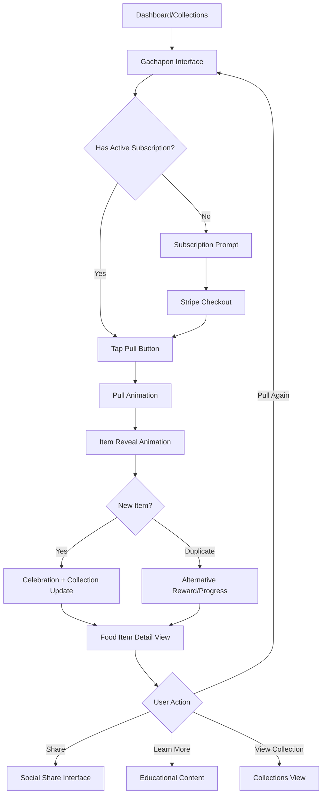
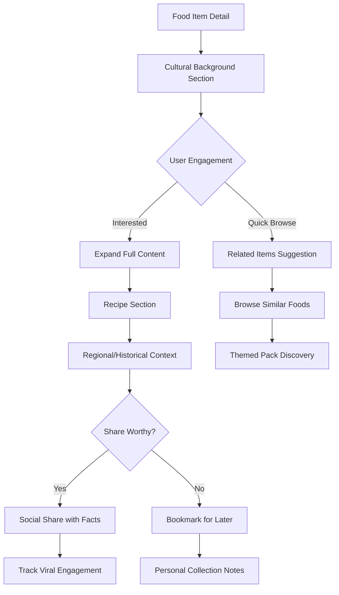
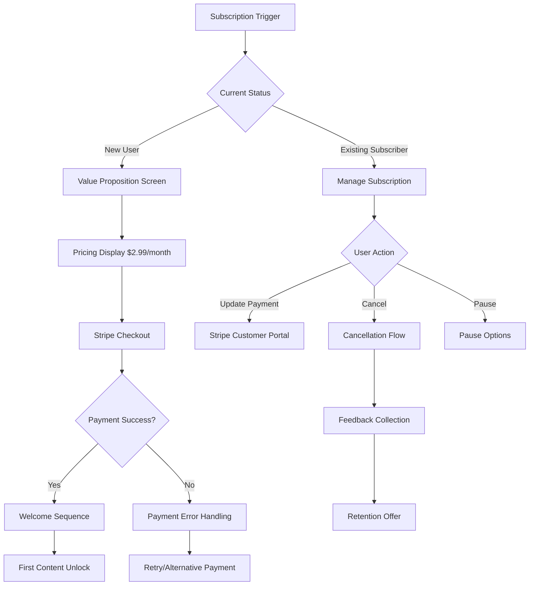

# FoodDrop UI/UX Specification

This document defines the user experience goals, information architecture, user flows, and visual design specifications for FoodDrop's user interface. It serves as the foundation for visual design and frontend development, ensuring a cohesive and user-centered experience.

## Overall UX Goals & Principles

### Target User Personas

**Primary: Casual Mobile Collectors**
- Age 25-40, seeks low-stress entertainment during short break periods (5-15 minutes)
- Values visual appeal, smooth interactions, and immediate gratification
- Frustrated by complex interfaces and aggressive monetization in other games
- Uses primarily mobile devices with occasional tablet/desktop access

**Secondary: Food Enthusiasts & Cultural Explorers**  
- Age 22-45, active on food-focused social media platforms
- Seeks authentic cultural content and educational value
- Willing to engage deeply with food history and recipe information
- Values shareable, well-researched content that reflects personal interests

### Usability Goals

- **Instant Access:** Users can start collecting food items within 30 seconds of first visit (no app download barriers)
- **Satisfying Interactions:** Gachapon pull animations provide tactile satisfaction at 60fps with immediate visual feedback
- **Educational Discovery:** 40%+ of collected items have their educational content viewed, indicating successful learning integration
- **Social Engagement:** 25%+ of users share collected items, demonstrating compelling social value
- **Collection Motivation:** Users complete themed collections with clear progress visualization and celebration

### Design Principles

1. **Delight Through Discovery** - Every interaction should feel like unwrapping a surprise gift with beautiful food imagery and satisfying animations
2. **Mobile-First Simplicity** - Touch-optimized interfaces that work perfectly on phones while scaling gracefully to larger screens  
3. **Educational Integration** - Learning content flows naturally from collection curiosity without interrupting the entertainment experience
4. **Cultural Respect** - Food representations are authentic, well-researched, and celebrate cultural heritage appropriately
5. **Frictionless Sharing** - Social features feel natural and encourage organic promotion without being pushy

### Change Log

| Date | Version | Description | Author |
|------|---------|-------------|---------|
| 2025-08-22 | 1.0 | Initial UI/UX specification creation | Sally (UX Expert) |

## Information Architecture (IA)

### Site Map / Screen Inventory

### Navigation Structure

**Primary Navigation:** Bottom tab bar for mobile with 4 core sections:
- Home (Dashboard with featured content and gachapon access)
- Collections (Organized by themed packs with progress indicators)  
- Discover (Educational content browsing and search)
- Profile (Account management, subscription, and settings)

**Secondary Navigation:** Contextual actions within screens:
- Food item details: Share, bookmark, related items
- Collection views: Filter by theme, sort by date/rarity
- Dashboard: Quick access to active themed packs

**Breadcrumb Strategy:** Minimal breadcrumbs due to mobile-first design. Back navigation through header back buttons with clear visual hierarchy showing current location within collections or educational content.

## User Flows

### Gachapon Collection Flow

**User Goal:** Collect new food items through satisfying gachapon mechanics

**Entry Points:** Main dashboard "Pull Now" button, themed pack access from collections

**Success Criteria:** User successfully pulls new food item, views item details, feels satisfied enough to pull again or explore educational content

#### Flow Diagram

#### Edge Cases & Error Handling:
- Subscription expired during session: Graceful payment prompt with session state preservation
- Network failure during pull: Animation completes with cached fallback, syncs when connection restored
- Animation performance issues: Reduce complexity while maintaining satisfaction
- Duplicate item management: Clear communication of progress value and alternative rewards

**Notes:** Critical flow for engagement and revenue. Animation timing must feel satisfying (2-3 seconds) while loading efficiently. Pull button should be large, prominently placed, and provide immediate visual feedback.

### Educational Content Discovery Flow  

**User Goal:** Learn about collected food items and discover cultural context

**Entry Points:** Food item detail from collection, Discover tab, shared links

**Success Criteria:** User engages with educational content, potentially shares discoveries, returns for more exploration

#### Flow Diagram

#### Edge Cases & Error Handling:
- Content loading failures: Graceful degradation with cached summary
- Inaccurate cultural information: Community reporting system and expert validation
- Recipe ingredient availability: Alternative suggestions and substitutions
- Overwhelming information: Progressive disclosure with clear information hierarchy

**Notes:** Educational content must feel discoverable, not forced. Use progressive disclosure to avoid overwhelming casual users while providing depth for enthusiasts.

### Subscription Management Flow

**User Goal:** Subscribe to access weekly content or manage existing subscription

**Entry Points:** Paywall prompts, profile settings, collection limitations

**Success Criteria:** Successful subscription signup or modification without confusion or frustration

#### Flow Diagram

#### Edge Cases & Error Handling:
- Payment method failures: Clear error messages with retry options and alternative payment methods
- Subscription changes mid-billing cycle: Pro-rated billing and clear communication
- International payment issues: Currency support and regional payment method options
- Accidental cancellations: Confirmation steps and easy reactivation

**Notes:** Critical for revenue generation. Must be transparent about pricing, easy to understand, and provide clear value communication. Stripe integration handles PCI compliance.

## Wireframes & Mockups

**Primary Design Files:** Wireframes created in this specification document with detailed interaction notes for developer implementation

### Key Screen Layouts

#### Main Dashboard

**Purpose:** Central hub for collection activity, featuring gachapon access and progress overview

**Key Elements:**
- Large, prominent "Pull Now" gachapon button (60% of screen width, with enticing animation preview)
- Weekly featured themed pack spotlight with visual preview and countdown timer
- Quick collection stats: Total items (Badge format), completion percentage, weekly progress
- Bottom tab navigation: Home, Collections, Discover, Profile

**Interaction Notes:** 
- Pull button should have subtle bounce animation on idle to draw attention
- Featured pack rotates weekly with smooth transition animation
- Stats update in real-time with satisfying number animations
- Optimized for thumb reach on 5-7 inch screens

**Design File Reference:** Mobile wireframe with 375px base width, scalable to tablet/desktop

#### Gachapon Pull Interface

**Purpose:** Core engagement screen delivering satisfying collection mechanics

**Key Elements:**
- Full-screen gachapon machine visual (whimsical, food-themed design)
- Large circular "PULL" button at bottom center (thumb-optimized positioning)
- Animation preview area showing capsule drop and reveal sequence
- Progress indicator for pull animation (2-3 second duration)
- Back navigation and subscription status indicator in header

**Interaction Notes:**
- Button press triggers immediate visual feedback (scale, color change)
- Animation sequence: Button press → Machine activation → Capsule drop → Reveal → Celebration
- Animation should feel substantial (not rushed) with satisfying sound effects
- Network failure gracefully handles with cached animations and sync later

**Design File Reference:** Full-screen mobile layout with landscape compatibility

#### Food Item Detail View

**Purpose:** Educational content presentation with sharing integration

**Key Elements:**
- High-quality food image hero section (50% of initial viewport)
- Expandable cultural background section with "Learn More" affordance
- Recipe section with ingredients list and preparation steps
- Social share buttons (Twitter, Facebook, Instagram, general share)
- Related items carousel at bottom for continued discovery

**Interaction Notes:**
- Progressive disclosure: Summary → Full content → Recipe details
- Share buttons pre-populate with food image, cultural fact, and FoodDrop promotion
- Related items scroll horizontally with swipe gestures
- Smooth transitions between expanded/collapsed content states

**Design File Reference:** Scrollable mobile layout with tablet adaptation

#### Collections Grid View

**Purpose:** Visual organization of collected items by themed packs

**Key Elements:**
- Themed pack headers with completion progress rings
- Grid layout of collected food items (3 columns mobile, 4+ tablet/desktop)
- Empty slots showing silhouettes of uncollected items
- Filter/sort options: Theme, Date collected, Rarity level
- Collection completion celebration triggers

**Interaction Notes:**
- Masonry grid layout adapts to different image aspect ratios
- Tap collected items for detail view, empty slots show preview/motivation
- Progress rings animate when collection updates
- Completion celebration: Confetti animation + badge unlock + share prompt

**Design File Reference:** Responsive grid system with mobile/tablet/desktop breakpoints

#### Subscription Management Interface

**Purpose:** Clear, trustworthy subscription signup and management

**Key Elements:**
- Value proposition summary: Weekly content, educational value, cultural discovery
- Pricing display: $2.99/month with weekly content breakdown
- Stripe checkout integration (hosted payment form)
- Current subscription status and next billing date
- Easy cancellation with retention offers

**Interaction Notes:**
- Clear value communication before payment request
- Stripe handles payment form UI and security
- Subscription status updates immediately upon successful payment
- Cancellation requires confirmation but isn't hidden or difficult

**Design File Reference:** Mobile-optimized checkout flow with Stripe integration examples

## Component Library / Design System

**Design System Approach:** Create a lightweight, food-themed design system optimized for mobile-first collection interactions. Focus on reusable components that maintain visual consistency while supporting the whimsical, educational brand personality.

### Core Components

#### Gachapon Button

**Purpose:** Primary interaction element for collection mechanics - must feel enticing and responsive

**Variants:** 
- Primary (Dashboard): Large, prominent with idle animation
- Secondary (Detail pages): Smaller "Pull Again" style
- Disabled (No subscription): Grayed out with upgrade prompt

**States:** 
- Idle (subtle bounce animation)
- Pressed (scale down + immediate feedback)
- Loading (pull animation sequence)
- Success (celebration glow)
- Disabled (muted colors + lock icon)

**Usage Guidelines:** Always center-positioned for thumb access, minimum 60px height on mobile, consistent animation timing across all variants

#### Food Item Card

**Purpose:** Display collected food items in grids and carousels with visual appeal

**Variants:**
- Collected (full color with completion badge)
- Uncollected (silhouette with mystery styling)
- Featured (enhanced border + spotlight effect)
- Shared (includes social proof indicators)

**States:**
- Default (clean, appetizing presentation)
- Hover/Focus (gentle lift animation)
- Loading (skeleton placeholder)
- Error (fallback placeholder image)

**Usage Guidelines:** Maintain consistent aspect ratio (4:3), always include alt text for accessibility, optimize images for mobile loading

#### Progress Ring

**Purpose:** Visual collection progress indication with satisfying completion animations

**Variants:**
- Themed pack progress (large, prominent)
- Overall collection progress (compact)
- Weekly progress (time-sensitive styling)

**States:**
- Empty (light gray ring)
- Partial (animated fill with percentage)
- Complete (celebration animation + checkmark)
- Loading (indeterminate spinner)

**Usage Guidelines:** Animate progress changes smoothly, use consistent color coding across all progress indicators

#### Educational Content Expandable

**Purpose:** Progressive disclosure of cultural and recipe information

**Variants:**
- Cultural background (expandable text sections)
- Recipe format (structured ingredients + steps)
- Historical context (timeline styling)

**States:**
- Collapsed (summary + "Learn More" affordance)
- Expanded (full content with smooth transition)
- Loading (content skeleton)

**Usage Guidelines:** Clear visual hierarchy, readable typography, smooth expand/collapse animations under 300ms

#### Social Share Panel

**Purpose:** Pre-formatted sharing with platform-specific optimization

**Variants:**
- Platform buttons (Twitter, Facebook, Instagram, general)
- Quick share (one-tap with default content)
- Custom share (user can add personal message)

**States:**
- Default (platform brand colors)
- Disabled (platform unavailable)
- Success (confirmation feedback)

**Usage Guidelines:** Respect platform brand guidelines, provide clear feedback on share completion, track engagement metrics

## Branding & Style Guide

**Brand Guidelines:** FoodDrop embodies culinary curiosity and cultural discovery through whimsical design that feels educational yet entertaining. The visual style should evoke the excitement of discovering authentic foods from around the world while maintaining respect for cultural heritage.

### Color Palette

| Color Type | Hex Code | Usage |
|------------|----------|--------|
| Primary | #FF6B35 | Gachapon buttons, key CTAs, collection completion celebrations |
| Secondary | #F7931E | Featured content highlights, themed pack accents, educational badges |
| Accent | #4ECDC4 | Cultural content sections, recipe highlights, progress indicators |
| Success | #2ECC71 | Positive feedback, collection success, achievement unlocks |
| Warning | #F39C12 | Subscription reminders, content expiration, important notices |
| Error | #E74C3C | Payment failures, network errors, invalid actions |
| Neutral | #2C3E50, #7F8C8D, #BDC3C7, #ECF0F1 | Text hierarchy, borders, backgrounds, subtle UI elements |

### Typography

#### Font Families
- **Primary:** Inter (clean, modern, excellent mobile readability)
- **Secondary:** Merriweather (educational content, cultural sections for warmth)
- **Monospace:** Fira Code (technical content, ingredient measurements)

#### Type Scale

| Element | Size | Weight | Line Height |
|---------|------|--------|-------------|
| H1 | 28px | 700 | 1.2 |
| H2 | 24px | 600 | 1.3 |
| H3 | 20px | 600 | 1.4 |
| Body | 16px | 400 | 1.5 |
| Small | 14px | 400 | 1.4 |

### Iconography

**Icon Library:** Phosphor Icons (consistent stroke width, excellent mobile visibility, food/cultural themed options available)

**Usage Guidelines:** 
- Use outlined style for interactive elements, filled for completed states
- Maintain 24px minimum size for touch targets
- Cultural food icons should be authentic and respectful representations
- Always provide text labels alongside icons for accessibility

### Spacing & Layout

**Grid System:** 8px base unit with 16px, 24px, 32px, 48px rhythm for consistent spacing

**Spacing Scale:** 
- xs: 4px (tight spacing within components)
- sm: 8px (related elements)
- md: 16px (section spacing)
- lg: 24px (major section breaks)
- xl: 32px (page-level spacing)
- xxl: 48px (hero sections, major visual breaks)

## Accessibility Requirements

**Standard:** WCAG 2.1 AA compliance with additional mobile accessibility considerations for touch-first interaction design

### Key Requirements

**Visual:**
- Color contrast ratios: 4.5:1 minimum for normal text, 3:1 for large text and graphical elements
- Focus indicators: 2px solid outline with high contrast color, visible on all interactive elements
- Text sizing: Minimum 16px body text, scalable up to 200% without horizontal scrolling

**Interaction:**
- Keyboard navigation: Full functionality accessible via keyboard with logical tab order
- Screen reader support: Semantic HTML, proper ARIA labels, descriptive alt text for all food images
- Touch targets: Minimum 44px x 44px for all interactive elements, adequate spacing between targets

**Content:**
- Alternative text: Descriptive alt text for food images including cultural context and visual details
- Heading structure: Logical H1-H6 hierarchy reflecting page content organization
- Form labels: Clear, descriptive labels for all form inputs with error state communication

### Testing Strategy

**Automated Testing:** Regular axe-core accessibility audits during development with CI/CD integration

**Manual Testing:** Monthly keyboard navigation testing, screen reader validation with NVDA/VoiceOver, color contrast verification

**User Testing:** Quarterly testing sessions with users who rely on assistive technologies

## Responsiveness Strategy

### Breakpoints

| Breakpoint | Min Width | Max Width | Target Devices |
|------------|-----------|-----------|----------------|
| Mobile | 320px | 767px | Smartphones (iPhone SE to iPhone 14 Pro Max, Android equivalents) |
| Tablet | 768px | 1023px | iPads, Android tablets, small laptops in portrait |
| Desktop | 1024px | 1439px | Laptops, desktop monitors, tablets in landscape |
| Wide | 1440px | - | Large monitors, ultrawide displays |

### Adaptation Patterns

**Layout Changes:** 
- Mobile: Single column, full-width components, vertical navigation
- Tablet: Two-column grids for collections, side-by-side content where appropriate
- Desktop: Three-column layouts, horizontal space utilization, sidebar navigation options
- Wide: Max-width containers (1200px) to prevent content stretching, additional whitespace

**Navigation Changes:**
- Mobile: Bottom tab bar, hamburger menu for secondary options
- Tablet: Hybrid approach - maintain bottom tabs with expanded touch targets
- Desktop: Traditional top navigation with hover states, sidebar options
- Wide: Persistent sidebar navigation with expanded menu options

**Content Priority:**
- Mobile: Progressive disclosure, essential content first, expandable sections
- Tablet: More content visible simultaneously, reduced need for expansion
- Desktop: Full content display, multiple information streams
- Wide: Additional context panels, related content suggestions

**Interaction Changes:**
- Mobile: Touch-optimized (44px minimum), swipe gestures, pull-to-refresh
- Tablet: Mixed touch/cursor, larger touch targets, drag-and-drop where beneficial
- Desktop: Cursor-optimized, hover states, keyboard shortcuts
- Wide: Enhanced cursor interactions, multi-column content manipulation

## Animation & Micro-interactions

### Motion Principles

**Purposeful Animation:** Every animation serves a functional purpose - providing feedback, guiding attention, or celebrating achievements. Animations should feel satisfying and substantial without being distracting or overwhelming.

**Performance First:** All animations optimized for 60fps on mobile devices with graceful degradation for older devices. Use CSS transforms and opacity for smooth performance, avoid animating layout properties.

**Respectful of Preferences:** Respect `prefers-reduced-motion` for users with vestibular sensitivities, providing static alternatives that maintain functionality.

### Key Animations

- **Gachapon Pull Sequence:** Multi-stage animation (Button press + Scale feedback → Machine activation → Capsule drop → Reveal transition) (Duration: 2500ms total, Easing: Cubic-bezier custom for anticipation)
- **Collection Progress Fill:** Smooth progress ring animation with elastic easing for milestone celebrations (Duration: 800ms, Easing: ease-out with overshoot)
- **Food Item Discovery:** Scale-up reveal with gentle bounce and glow effect for new items (Duration: 600ms, Easing: cubic-bezier(0.68, -0.55, 0.265, 1.55))
- **Navigation Transitions:** Smooth page transitions with directional slides maintaining context (Duration: 300ms, Easing: ease-in-out)
- **Share Button Feedback:** Quick scale pulse with platform color transition for immediate gratification (Duration: 200ms, Easing: ease-out)
- **Completion Celebration:** Multi-element confetti animation with badge reveal and social share prompt (Duration: 1500ms, Easing: various for natural movement)
- **Educational Content Expand:** Height animation with fade-in for progressive disclosure (Duration: 400ms, Easing: ease-out)
- **Loading States:** Skeleton placeholder animations with shimmer effect for content loading (Duration: 1200ms loop, Easing: linear)

*Document in progress - Interactive mode*